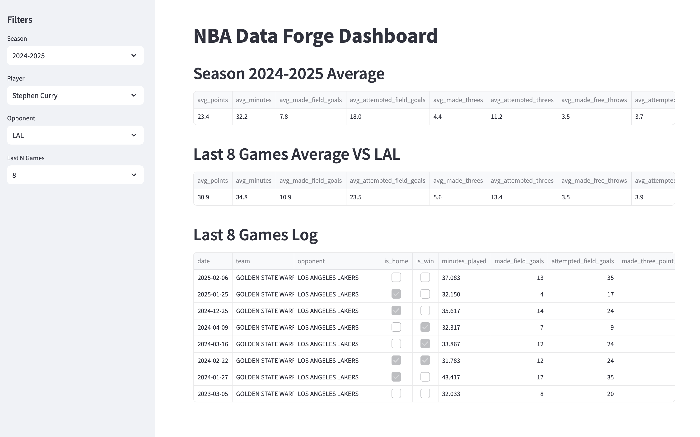
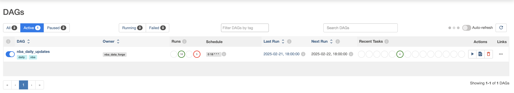

# NBA Data Forge

A data engineering portfolio project showcasing ETL pipeline development, API implementation, and data visualization.



## Project Overview

NBA Data Forge is a portfolio project showcasing end-to-end data engineering skills:

- **ETL Pipeline:** Automated with Apache Airflow for processing NBA game stats.
- **API:** FastAPI-powered endpoints for seamless data access.
- **Dashboard:** Streamlit-built interface for exploring player stats interactively.
- **Database:** PostgreSQL with SQLAlchemy ORM for robust storage.

Built to demonstrate real-world data workflows, from ingestion to visualization.

## Features

### Data Pipeline
```
extract_games >> transform_games >> load_games >> validate_games
```

- **Historical Data:** Rate-limited API pulls with retry logic, resumable via checkpoints.
- **Incremental Updates:** Airflow DAGs automate upserts, validated across stages, with archived files.



### API Implementation

- `GET /api/v1/players/` - List players for a given season (2004-2025)
- `GET /api/v1/players/{player_id}/season/{season}` - Get player's season statistics with optional home/away and win/loss filters
- `GET /api/v1/players/{player_id}/vs-opponent-stats` - Get player's statistics with opponent and recent game filters


### Interactive Dashboard

Interactive Streamlit UI with:

- Filters: Season (2004–2025), player, opponent, last N games ().
- Views:
  1. Season averages (points, shooting, etc.).
  2. Vs. team analysis (last N games stats).
  3. Game logs (date, teams, full stats).

### Data Analysis Insights

This project analyzed 539,777 NBA game logs (2003–2025) and 396 daily logs (Feb 4–5, 2025) to ensure data quality for the pipeline:

- Confirmed no missing values or duplicates across all records.
- Standardized team names, locations, and outcomes (e.g., “Team.TEAM_NAME” format).
- Validated balanced distributions (home/away, win/loss) and transformation consistency.
- Handled historical team transitions (e.g., Seattle SuperSonics → Oklahoma City Thunder). See the full analysis in [NBA Game Log Analysis Notebook](docs/data_exploration.ipynb).

## Technical Stack

- **Backend**: FastAPI, PostgreSQL, SQLAlchemy
- **ETL**: Apache Airflow, Pandas
- **Frontend**: Streamlit
- **Development**: Python 3.12+, Docker

## Project Structure

```
nba_data_forge/
├── src/
│   ├── api/            # FastAPI endpoints + logic
│   ├── common/         # Shared utilities
│   ├── dashboard/      # Streamlit UI
│   └── etl/            # Extractors, transformers, loaders
├── tests/              # Integration tests
├── airflow/            # Airflow DAG files
└── docs/               # Documentation (e.g., analysis notebook)
```

## Setup (Local Only)

### Prerequisites
- Python 3.12+
- PostgreSQL 16+
- Docker

### Steps
1. Clone: `git clone https://github.com/yourusername/nba_data_forge.git`
2. Virtual Env: `python -m venv venv && source venv/bin/activate` (Linux/Mac) or `.\venv\Scripts\activate` (Windows).
3. Install: `pip install -r requirements.txt`.
4. Create DB: `createdb nba_data`.
5. Config: Update `config.ini` with your PostgreSQL credentials.
6. Run:
  - API: `uvicorn nba_data_forge.api.main:app --reload`
  - Dashboard: `streamlit run nba_data_forge/dashboard/main.py`
Note: Data not included due to source restrictions—run locally with your own fetch


## Data Sources & Disclaimer

Sourced from [Basketball Reference](https://www.basketball-reference.com/) via [basketball_reference_web_scraper](https://jaebradley.github.io/basketball_reference_web_scraper/). For educational use only; not affiliated with the NBA or Basketball Reference. Full dataset not hosted per Basketball Reference terms—code and sample outputs provided.

## What I Learned
- **Pipeline Setup**: Learned to configure Apache Airflow DAGs, pass information between tasks, and save raw/processed files for efficient task referencing.
- **API Design**: Leveraged SQLAlchemy for database models, Pydantic for data schemas and response models, and FastAPI for flexible, high-performance API design suited for real-world usability.
- **Data Challenges**: Handled API rate limits with retry logic to ensure reliable data collection, working with relatively well-structured NBA stats.
- **Data Quality**: Standardized 500K+ records, ensuring no duplicates or missing values for reliable insights.

## License
This project is licensed under the MIT License - see the [LICENSE](LICENSE) file for details.

## Testing Implementation
Comprehensive suite covering:

- API endpoints (via `test_player_stats.py`).
- ETL transforms (`test_transformer.py`).
- DB ops (`test_upsert_functionality.py`). Run with: `pytest tests/`.